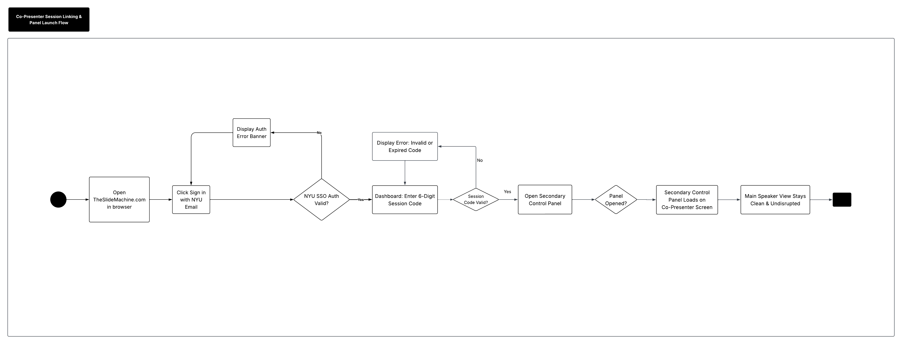

# Specification Phase Exercise

A little exercise to get started with the specification phase of the software development lifecycle. In this exercise, your team specifies a set of improvements and new features for [The Slide Machine](https://theslidemachine.com) — see the [instructions](instructions.md) for detail, and the [background](background.md) for an introduction to the software product you are tasked with extending.

## Team members

Nishika: https://github.com/nishikagorla
Nihal: https://github.com/NISUN05
Pranay: https://github.com/PranayEng
Asri: https://github.com/scanfasri
Adil: https://github.com/ai2652-png

## Review of the Current Application

### Strengths

- **Strength - Organizing raw input:** When we gave the application messy and unstructured notes with repeated ideas and mistakes while speaking, it organized it into a coherent presentation and removed much of the unnecessary repetition.

- **Strength - Slide organization:** The application does a good job of deciding when information should be separated into different slides instead of putting everything on one slide.

- **Strength - Consistent formatting:** The slides it generates have a consistent visual style, with uniform fonts, colors, spacing, and formatting.

### Weaknesses

- **Weakness - Treats uncertain information as fact:** When we intentially said "I think around 1,000 students study abroad each year," it presented the number as a definite fact instead of preserving the uncertainty.

- **Weakness - AI embellishment:** When only said that NYU dining hall food is good, it expanded this into claims about "high-quality food options across campus locations." We never provided that in our input, so the AI seems to introduce unsupported details.

- **Weakness - Processing delay during rapid input:** When we spoke quickly and provided a lot of information, the application took time to process and generate the slides. This noticeable delay can be a hindrance during live presentations.

### Gaps

- **Gap - Speaker notes:** There doesn't seem to be an option to generate or write speaker notes for users who want to add notes to help them present the deck later.

- **Gap - Chart generation:** When we provided numerical data comparing NYU’s global locations, the app kept the information as text rather than generating a chart. Adding automatic chart generation would make this type of information easier to present visually.

- **Gap - Advanced layout editing:** There is limited control over the individual layout of a slide. Users can change the overall template, but there's no advanced editor for freely moving, resizing, or repositioning individual elements on the slides.

- **Gap - Dedicated correction workflow:** The only available ways to make corrections or adjustments to the slides are for the presenter to verbally instruct the AI or manually trigger regeneration. There is currently no way to provide the AI with precise, text-based prompts to make specific changes to the slides in real time.

## Prior Art & Originality

We reviewed The Slide Machine's SPEC.md (including §18 Future Work and §19 Open Questions), ROADMAP.md, DECISIONS.md, MCP.md, and all open issues and pull requests. None of these specify a secondary co-presenter controller. The closest existing work is different. Voice commands (CAP-4) are spoken by the main presenter and limited to navigation. The typed-phrase box is a developer-only debug tool. The AI-assistant (MCP) integration explicitly excludes live class use. DECISIONS.md states that multiple co-presenters are not supported. Issue 134 (real-time collaborative editing) concerns co-editing deck content, not steering generation during a live session. Our original contribution is a separate co-presenter controller that can send typed prompts into the live generation pipeline in real time without the audience seeing it.

## Stakeholders

### User Type 1: Student

#### Stakeholder Profile: Annalise (Student)

* **Goals & Needs:**
  1. **Lecture Focus:** A tool that allows her to remain fully engaged with the presenter instead of constantly switching focus between listening and note-taking.
  2. **Automated Transcription:** Real-time speech-to-text functionality that accurately captures spoken lecture content.
  3. **Streamlined Slide Creation:** A fast, low-effort process for converting spoken or written concepts into complete slide decks.
  4. **Automated Formatting:** Intelligent layout and design capabilities that make slides look visually appealing without manual adjustment.

* **Problems & Frustrations:**
  1. **Transcription Inaccuracy:** When speaking from a script, the AI missed critical details and key information.
  2. **Broken Visual Layouts:** Formatting issues disrupted the output (e.g., her title slide truncated halfway through the title with `...`).
  3. **Pacing & Latency Friction:** Forced to pause repeatedly while speaking to allow the AI to catch up and generate slides, disrupting her speaking flow.
  4. **Usability Barriers:** Found the overall navigation and user interface unintuitive to operate during testing.

* **User Testing Observations:**
  * Observed noticeable pauses during live presentation input due to real-time AI processing delay.
  * Encountered UI rendering bugs on longer titles, leading to visual truncation.

---

### User Type 2: Instructor

#### Stakeholder Profile: Raj (Instructor)

* **Goals & Needs:**
  1. **Minimalist UI:** A clean, distraction-free interface that is easy to navigate during live instruction.
  2. **Cost & Experience:** Ad-free experience with transparent, open access for educational settings.
  3. **Maintainability & Extensibility:** A platform actively developed with a clear roadmap for future updates and features.
  4. **Hands-Free Operation:** Speech-driven control options that allow him to teach without being tied to a keyboard.

* **Problems & Frustrations:**
  1. **Lack of Session Controls:** Live recording/generation initiated immediately upon launch without a manual "Start" toggle, offering no preparation window.
  2. **Data & Privacy Concerns:** Expressed concern over data exposure after noticing other users' project titles and student names visible in the app interface.
  3. **Over-Reliance on AI:** Preferred a robust core slide-building application with *optional* AI integration, rather than a app centered entirely around automated generation.
  4. **Poor AI Synthesis & Context:** The app merely copied and pasted spoken words verbatim onto slides rather than summarizing, synthesizing, or expanding upon the material.
  5. **Irrelevant Media Generation:** The automated image feature fetched inaccurate and contextually mismatched images based on spoken input.

* **User Testing Observations:**
  * Experienced immediate friction upon landing on the interface due to auto-initiating live mode.
  * Expressed strong security concerns regarding student data visibility in public dashboards.

  ### User Type 3: Instructor

#### Stakeholder Profile: Charli Sas (Instructor)

* **Goals & Needs:**
  1. **Preserve Natural Classroom Discussion:** Wants classroom conversations to remain flexible and does not believe everything said during class needs to be automatically recorded or converted into slides.
  2. **Teacher-Guided Feedback:** Wants technology to help instructors recognize where students are struggling while still allowing the instructor to personally respond and reteach material.
  3. **Recurring Mistake Detection:** Would benefit from a feature that identifies patterns in student mistakes so instructors can determine when an individual student or the entire class needs additional instruction.
  4. **Quick Student Assessment:** Values simple tools, such as exit-ticket quizzes, that help instructors understand student comprehension at the end of a lesson.

* **Problems & Frustrations:**
  1. **Over-Automation of Classroom Content:** Does not want AI to automatically turn everything said during a lecture or discussion into written slides.
  2. **Loss of Instructor Awareness:** Expressed concern that automated grading could distance instructors from understanding the specific concepts their students are struggling with.
  3. **Limited Usefulness of Translation Tools:** A real-time translation feature would not be especially practical within the structure of his classroom.
  4. **AI Replacing Instructor Judgment:** Prefers AI features that assist instructors rather than completely taking over tasks such as grading, feedback, or determining what classroom information should be preserved.

* **User Testing Observations:**
  * Responded positively to the exit-ticket quiz feature and viewed it as a useful way to evaluate student understanding.
  * Suggested adding a feature that detects recurring student mistakes and alerts the instructor when reteaching may be necessary.
  * Preferred AI tools that support instructor decision-making rather than automatically replacing existing teaching practices.

  ### User Type 4: Student

#### Stakeholder Profile: Damon (Student) 

* **Goals & Needs:**
  1. **Easier Note-Taking:** Wants technology that reduces the amount of manual note-taking required during lectures.
  2. **Organized Lecture Content:** Values having important classroom information automatically organized into an easier-to-review format.
  3. **Efficient Study Materials:** Wants lecture content to be transformed into useful materials that can be reviewed after class.
  4. **Simple User Experience:** Prefers an application that is easy to understand and does not require a complicated setup process.

* **Positive Feedback:**
  1. **Overall App Concept:** Responded positively to the idea of using the application as a classroom and study tool.
  2. **Automation:** Liked the ability of the application to reduce the amount of repetitive work students normally have to do themselves.
  3. **Study Support:** Saw value in having lecture information available in an organized format for later review.
  4. **Convenience:** Appreciated having multiple classroom and study features available within one application.

* **User Testing Observations:**
  * Had an overall positive reaction to the application and its usefulness for students.
  * Viewed the automated features as helpful for reducing the effort required to capture and organize classroom information.
  * Demonstrated interest in using the application as a supplemental tool for reviewing material outside of class.

## Product Vision Statement

Our team is enhancing The Slide Machine by introducing a discreet secondary controller feature that allows a co-presenter to send direct text prompts to the AI in real time, eliminating errors caused by missed or misheard verbal cues while keeping the audience's view completely seamless and professional.

## User Requirements

User Type 1: Co-Presenter 

User Stories: 

1. As a Co-Presenter, I want to link my instance of Slide Machine to the active presentation via a private session code, so that I can open the secondary control panel on my own device without disrupting the main speaker. 

2. As a Co-Presenter, I want to send direct text prompts through my secondary control panel while the main speaker is talking, so that I can silently provide missing terminology or key facts to the Ai without forcing the speaker to pause. 

3. As a Co-Presenter, I want to preview the AI-generated slide draft on my secondary panel before releasing it to the main view, so that I can check for broken formatting or truncated titles before the audience sees them. 

4. As a Co-Presenter, I want to view a real-time status queue of my submitted text prompts inside my control panel, so that I can monitor which instructions the AI is actively processing. 

5. As a Co-Presenter, I want to receive an immediate error notification in my control panel if my prompt fails or drops connection, so that I know exactly when I need to re-submit my instruction. 

6. As a Co-Presenter, I want to retract or delete a queued prompt with a single click, so that I can stop the AI from generating a slide if the main speaker addresses the point verbally. 

7. As a Co-Presenter, I want to specify whether my prompt updates the active slide or generates a new one, so that I can refine existing content on screen without creating unnecessary extra slides. 

8. As a Co-Presenter, I want to access a history log of all prompts sent during the session, so that I can review the past commands and quickly re-use effective ones. 

9. As a Co-Presenter, I want customizable shortcut buttons in my control panel for common commands (like "Summarize in x Bullets" or "Fix Formatting"), so that I can refine slides in two seconds without having to type out long instructions during a fast-paced lecture. 

10. As a Co-Presneter, I want to send private, discreet cue messages directly to the main speaker's screen, so that we can coordinate seamlessly without speaking out loud or disruptiong the audience. 

11. As a Co-Presenter, I want to target a specific element on the active slide (e.g., "Title", "Bullet 2", "Graph"), so that the AI edits only that component without re-generating the entire slide.

12. As a Co-Presenter, I want to drag and re-order prompts in my active queue, so that I can prioritize urgent factual corrections over general formatting tweaks.

13. As a Co-Presenter, I want to edit the text of a queued prompt before the AI starts processing it, so that I can fix my own typos or update the instructions on the fly.

14. As a Co-Presenter, I want to cancel or delete a queued prompt with a single tap, so that I can stop generation if the speaker addresses the point verbally.

15. As a Co-Presenter, I want to reject a generated slide draft with a "Discard" button, so that a poorly formatted slide never makes it to the main presentation.

16. As a Co-Presenter, I want to click a "Push to Audience Screen" button on my draft preview, so that the approved slide update immediately publishes to the public display.

17. As a Co-Presenter, I want to make direct text edits to the pre-release slide draft on my screen, so that I can make minor touch-ups manually before pushing it to the main screen.

18. As a Co-Presenter, I want to preview an AI-generated slide draft on my secondary device before publishing it live, so that I can verify visual formatting and title lengths.

User Type 2: Main Speaker 

User Stories: 

1. As a Main Speaker, I want a toggle in my control panel to temporarily pause the speech-to text microphone feed, so that I can prevent the AI from generating junk slides when I takes side questions or go-off script. 

2. As a Main Speaker, I want to generate host code from my presentation view, so that my Co-Presenter can pair their secondary control panel.

3. As a Main Speaker, I want private banner messages from my Co-Presenter to appear briefly on my speaker screen (such as "Key detail added" or "2 minutes left"), so that we can coordinate seamlessly without speaking out loud or using other digital modes of communication. 

4. As a Main Speaker, I want to toggle between 
"Auto-Publish Mode" and "Approval Required Mode" for secondary prompts, so that I can decide whtether co-presenter edits go live insantly or wait for my approval. 

5. As a Main Speaker, I want a "Freeze Audience View" toggle that locks the main display on the current slide, so that I can privately review co-presenter draft proposals or resolve prompt errors.

6. As a Main Speaker, I want a single-click button to kick or disconnect an unauthorized secondary device, so that I retain full security access over my live presentation session.

7. As a Main Speaker, I want a subtle visual badge showing my co-presenter's connection health, so that I know immediately if my partner drops offline. 

8. As a Main Speaker, I want to set a maximum limit on connected secondary devices, so that extra devices do not overload my session or introduce confusion.

9. As a Main Speaker, I want to assign granular permission levels to connected controllers (e.g., "Cue Messages Only", "Text Edits Only", "Full Layout Control"), so that I can bound how much influence a guest co-presenter has.

10. As a Main Speaker, I want to view a real-time list of all connected secondary devices with their names, so that I know exactly who is active in my session.

11. As a Main Speaker, I want to disconnect or block an unauthorized secondary device in one click, so that I maintain full control over my live presentation.

12. As a Main Speaker, I want to press a single hotkey to accept or reject a pending co-presenter slide draft, so that I can approve updates mid-speech without touching a mouse.

13. As a Main Speaker, I want to transfer slide-advancement authority to my co-presenter’s secondary controller, so that they can control the deck during their co-teaching segment.

14. As a Main Speaker, I want a single-key emergency undo shortcut on my presenter screen, so that I can instantly revert an unwanted slide change made by my co-presenter

15. As a Main Speaker, I want the presentation view to gracefully roll back to the last stable slide layout if an AI generation times out or fails, so that the audience never sees a broken screen.

16. As a Main Speaker, I want the system to seamlessly transition to standard manual slide-advance mode if AI API rate limits are hit, so that my presentation experience remains unbroken.

## Activity Diagrams

### Co-Presenter Workflow(1)

#### User Story
As a Co-Presenter, I want to send direct text prompts through my secondary control panel while the main speaker is talking, so that I can silently provide missing terminology or key facts to the AI without forcing the speaker to pause.

#### Activity Diagram
[Link](https://lucid.app/lucidspark/4ef88773-2451-4fc7-9989-e1650afa9442/edit?viewport_loc=1992%2C-2508%2C2048%2C1036%2C0_0&invitationId=inv_560e05f6-d7e0-431f-b126-4e81e6e6cdc3) 

### Co-Presenter Workflow(2) 

#### User Story
As a Co-Presenter, I want to link my instance of Slide Machine to the active presentation via a private session code, so that I can open the secondary control panel on my own device without disrupting the main speaker. 

#### Activity Diagram
[Link](https://lucid.app/lucidchart/9c42c866-245c-41c9-85ff-dd8fc3396709/edit?view_items=_b6xS5gq28EI&page=0_0&invitationId=inv_c627afd7-8d78-4e07-899e-565741232003)

### Main Presenter Workflow(1)

#### User Story
As a Main Presenter, I want the system to automatically trigger a rollback to the last stable layout if an AI generation fails or encounters rendering errors, so that my audience never sees a broken presentation screen on stage.

#### Activity Diagram
[Link](https://lucid.app/lucidchart/9ee911ec-7760-4c7a-a04a-885810ab89ce/edit?viewport_loc=-1851%2C-1635%2C8863%2C5267%2C0_0&invitationId=inv_bfa26cde-c94e-4f0e-8cc5-0f9137e35916)

### Main Presenter Workflow(2)
.png) 

#### User Story 
As a Main Speaker, I want to generate host code from my presentation view, so that my Co-Presenter can pair their secondary control panel.

#### Activity Diagram
[Link](https://lucid.app/lucidchart/635afcc8-9751-4764-ac3b-2f7ad0646418/edit?view_items=hG6xsyIxfC~-&page=0_0&invitationId=inv_522db4d5-4c4b-419f-a6ec-6656fdf84f8b)

## Wireframes

### 00. Start

### 01. Dashboard

### 02. Live lecture - listening

### 03. Live lecture - generated

### 04. Connect co-presenter

### 05. Pop-up blocked

### 06. Join by code

### 07. Invalid or full session

### 08. Secondary controller

### 09. Processing queue

### 10. Network failure

### 11. AI unavailable

### 12. Manual draft editing

### 13. Private draft preview

### 14. Edit draft text

### 15. Speaker approval

### 16. Published correction

### 17. Rejected draft

### 18. Private cue composer

### 19. Speaker cue

### 20. Connected controllers

### 21. Auto-publish setting

### 22. New-slide prompt

### 23. New-slide preview

### 24. New-slide approval

### 25. New slide on stage

### 26. Slide render failure

### 27. Regenerating

### 28. Stable fallback

### 29. Prompt history

### 30. Frozen audience

### 31. Session ended

### 32. Review while audience frozen

### 33. Accepted

### 34. Update undone

## Clickable Prototype

https://www.figma.com/design/4fY6vPE6rTpBHP2NpGHazu/Final-Wireframe-Diagram?node-id=0-1&p=f&t=DoECrfMY92EnwSGe-0

## Stakeholder Demo

[Stakeholder Demo Presentation Deck](https://theslidemachine.com/d/untitled-f9124a74)

## Exit Ticket

[Exit Ticket Quiz](https://docs.google.com/forms/d/e/1FAIpQLSc8zvuoAWQ5vVx3s0YJ-M90dhleeAyjmiG7u-oyfXNCQv15Qw/viewform)
